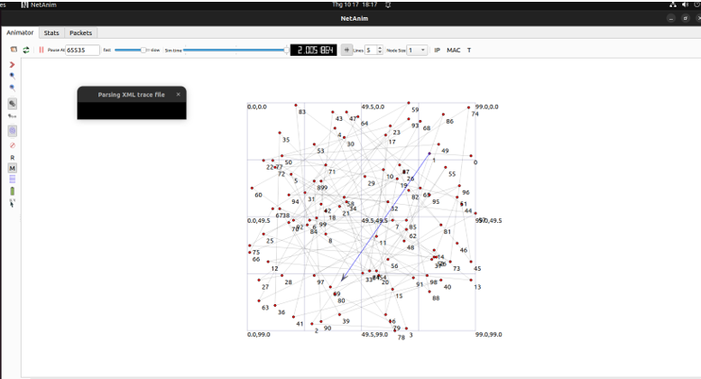
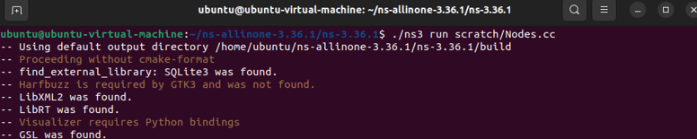

# ns-3
ns-3 is a discrete-event network simulator for Internet systems, targeted primarily for research and educational use.

Script work on version ns-3.30 or higher

Install nessesary plugins for ns-3 in req.txt.

Run with ./ns3 run scratch/Nodes.cc & open graphical interface with NetAim (check req.txt)

